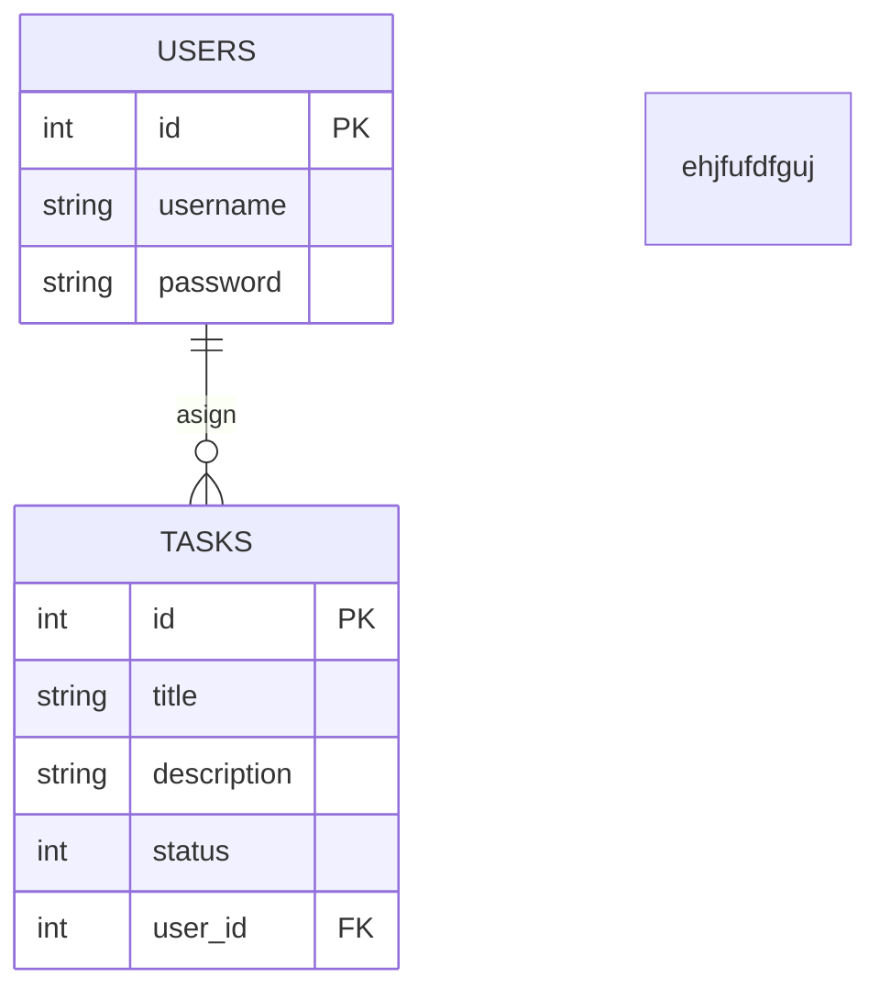

# crud
CRUD es un acrónimo que se refiere a las cuatro operaciones básicas que se realizan sobre los datos en una base de datos o sistema de gestión de bases de datos(create,update,delete,read)
crud con cual tiene una relacion mas fuerte?python pq tiene que pasar por el para llegar a sql
(un crud es una interfaz basica  que nos permite interactuar con una base de datos(create,read,delete.update))
# cursor y conecetor
cursor-Ejecuta comandos SQL: Usas el cursor para enviar consultas SQL (como SELECT, INSERT, UPDATE, DELETE) a la base de datos.
connector:El conector (en este caso conn) es el objeto que se utiliza para establecer y mantener la conexión con la base de datos
(el cursor sirve para el select y el resto como son para modificar la tabla se hace con una conexion pa hay que hacer commit)
# Primary key Foreign key
Una clave primaria es un campo o conjunto de campos en una tabla que identifica de manera única cada fila o registro en esa tabla. Es decir, cada valor de la clave primaria debe ser único, lo que garantiza que no haya dos filas con el mismo valor en esa columna o combinación de columnas.
Una clave foránea es un campo (o conjunto de campos) en una tabla que hace referencia a la clave primaria de otra tabla. Se utiliza para establecer una relación entre dos tablas y garantizar la integridad referencial entre ellas
# cheeatsheets sqlite
Un cheatsheet de SQLite es una herramienta útil y práctica que proporciona un resumen rápido de los comandos y funciones más utilizados en SQLite. Sirve tanto para aprender como para trabajar de manera más eficiente con bases de datos SQLite en el desarrollo de aplicaciones.
ejemplo:
### Creación de una tabla
CREATE TABLE usuarios (
    id INTEGER PRIMARY KEY AUTOINCREMENT,
    nombre TEXT NOT NULL,
    correo TEXT UNIQUE
);

### Insertar datos
INSERT INTO usuarios (nombre, correo)
VALUES ('Juan', 'juan@ejemplo.com');

### Seleccionar datos
SELECT * FROM usuarios;

### Filtrar resultados
SELECT * FROM usuarios WHERE correo = 'juan@ejemplo.com';

### Actualizar datos
UPDATE usuarios
SET nombre = 'Juan Pérez'
WHERE id = 1;

### Eliminar datos
DELETE FROM usuarios WHERE id = 1;

### Crear una clave foránea
CREATE TABLE tareas (
    id INTEGER PRIMARY KEY,
    descripcion TEXT NOT NULL,
    usuario_id INTEGER,
    FOREIGN KEY (usuario_id) REFERENCES usuarios(id)
);

### Funciones agregadas
SELECT COUNT(*) FROM usuarios;
SELECT AVG(edad) FROM usuarios;
SELECT MAX(edad) FROM usuarios;

### Uniones de tablas (JOIN)
SELECT tareas.descripcion, usuarios.nombre
FROM tareas
INNER JOIN usuarios ON tareas.usuario_id = usuarios.id;

### Crear un índice
CREATE INDEX idx_usuario_email ON usuarios(correo);

# req y get 
req (request) es el objeto que contiene información sobre la solicitud del cliente (como los encabezados, parámetros de la URL, etc.).
res (response) es el objeto que se utiliza para enviar una respuesta al cliente.
GET es uno de los métodos HTTP más comunes y se usa para solicitar recursos (como HTML, imágenes, datos JSON, etc.) del servidor sin hacer cambios en el servidor (es decir, no hay efectos secundarios en el servidor).
ejemplo:
const express = require('express');

// Crear una instancia de la aplicación Express
const app = express();

// Definir una ruta GET
app.get('/saludo', (req, res) => {
    // Enviar una respuesta con un saludo
    res.send('¡Hola! Bienvenido a mi servidor Express');
});

// El servidor escucha en el puerto 3000
app.listen(3000, () => {
    console.log('Servidor corriendo en http://localhost:3000');
});
# diagrama

# apendchild
 te permite añadir algo nuevo dentro de otro elemento en una página web.
 El querySelector  encuentra un elemento en la página por su id, clase, o alguna otra característica que tú le digas
 el create element te permite crear un nuevo "bloque" o "etiqueta" en la página web sin tener que escribirlo directamente en el código HTML.